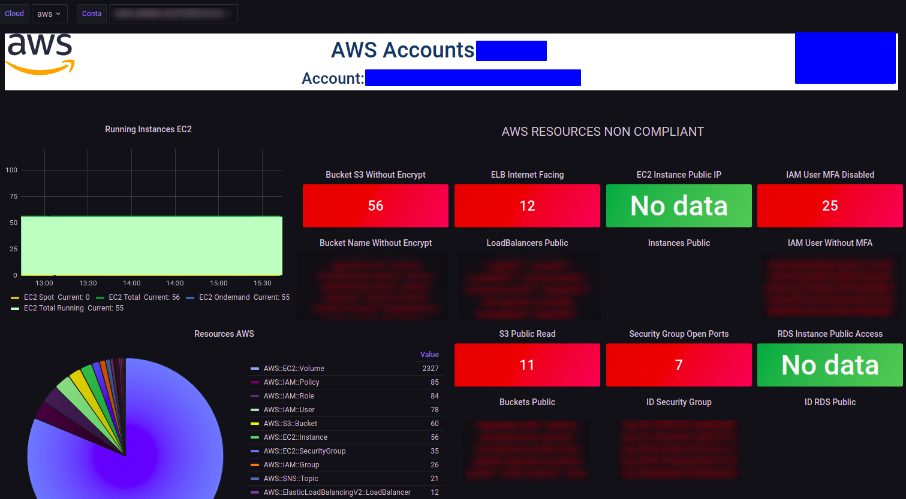
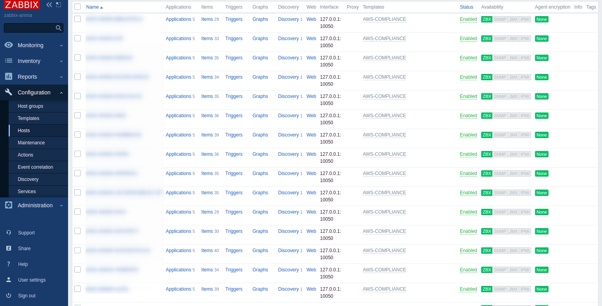

### AWS Config + Zabbix + Grafana

A um tempo atrás me deparei com um desafio que era dar visibilidade na quantidade de recursos criados em mais de 15 contas da AWS que faziam parte de uma Organization.
A ideia era mostrar isso de uma forma centralizada no Grafana. Então tive a ideia de habilitar o AWS Config aonde ele me mostra um inventário de toda a conta. Com o config habilitado eu adicionei as seguintes regras para me mostrar o que não estava em conformidade no ambiente.
As regras foram:
- s3-bucket-public-read-prohibited 
Regra que mostra quais buckets s3 estão públicos.
- rds-instance-public-access-check 
Regra que mostra quais instâncias RDS estão públicas.
- ec2-instance-no-public-ip 
Regra que mostra quais instâncias estão com IP público.
- vpc-sg-open-only-to-authorized-ports 
Regra que mostra quais portas em um Security Group estão apontando para range 0.0.0.0/0.
- iam-user-mfa-enabled 
Regra que mostra quais contas de IAM User não estão com o MFA habilitado.

### Exemplo do dahsboard no Grafana

#### Configuração no Zabbix

Para configurar no zabbix, basta copiar os scripts que estão no diretório "scrips-zabbix" e colocar dentro do diretório de scripts do zabbix.  No meu zabbix eu criei uma pasta scripts dentro do "/etc/zabbix/". 
E também copiar os arquivos de User Parameter que estão no diretorio "zabbix_agent.d" para o diretório do zabbix "/etc/zabbix/zabbix_agent.d". 

No console do zabbix importar o template "AWS-COMPLIANT.xml" que se encontra no diretório "template-zabbix". 
Criar um host para cada conta da AWS que for ser monitorada e atribuir o template "AWS-COMPLIANT".

#### Configuração no Grafana

No grafana 